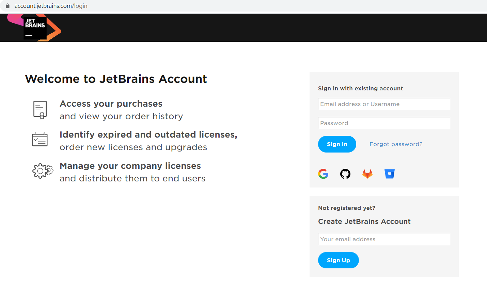
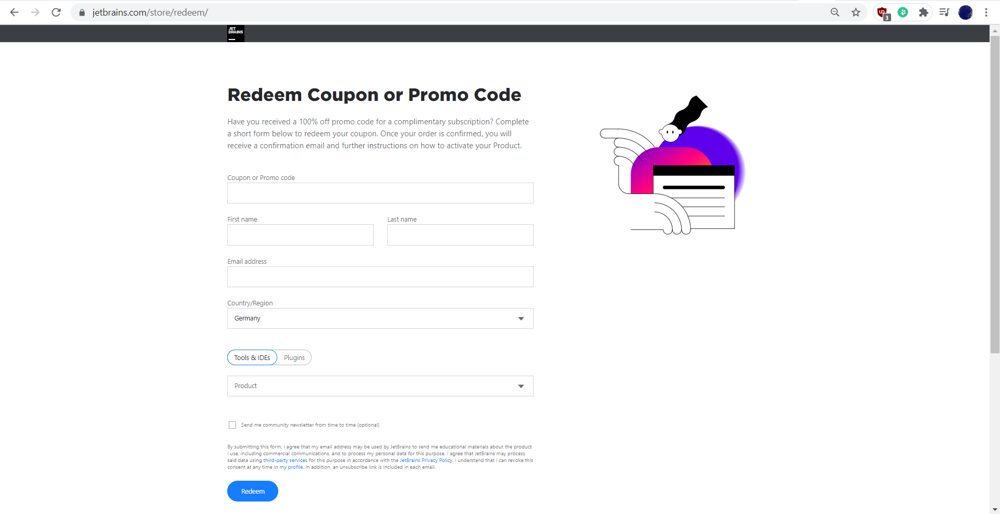
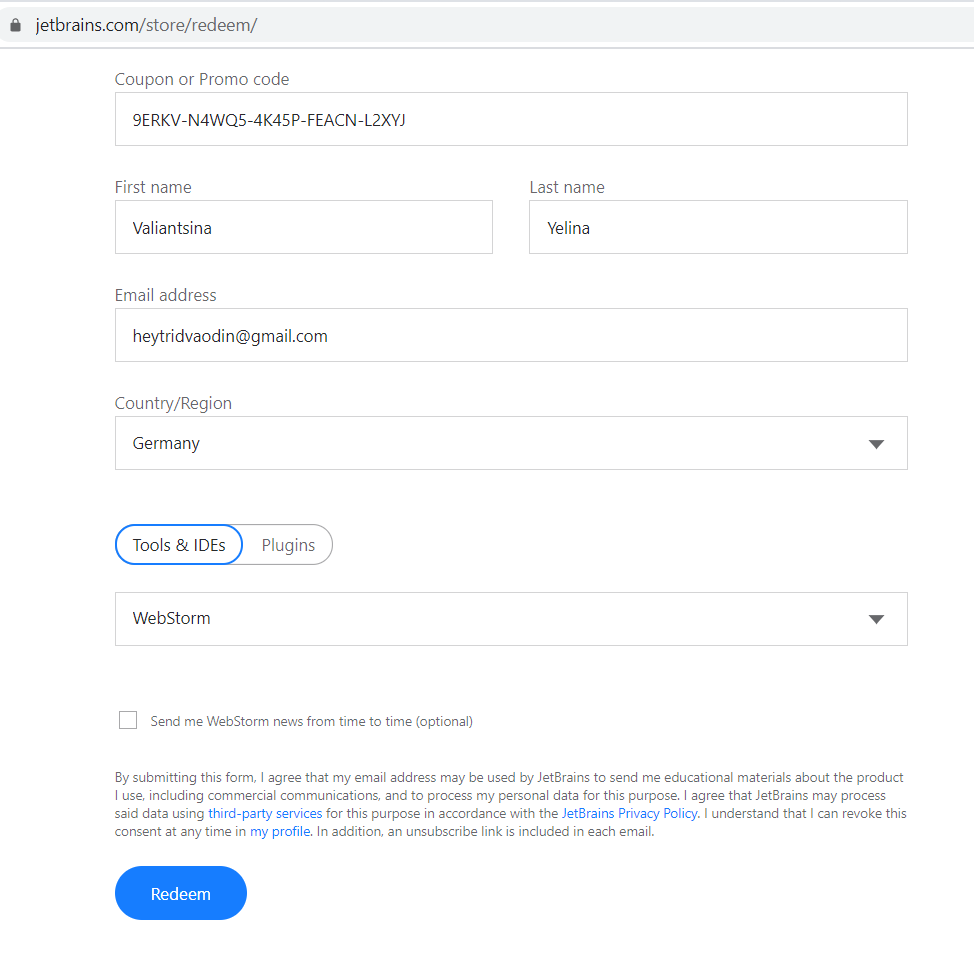
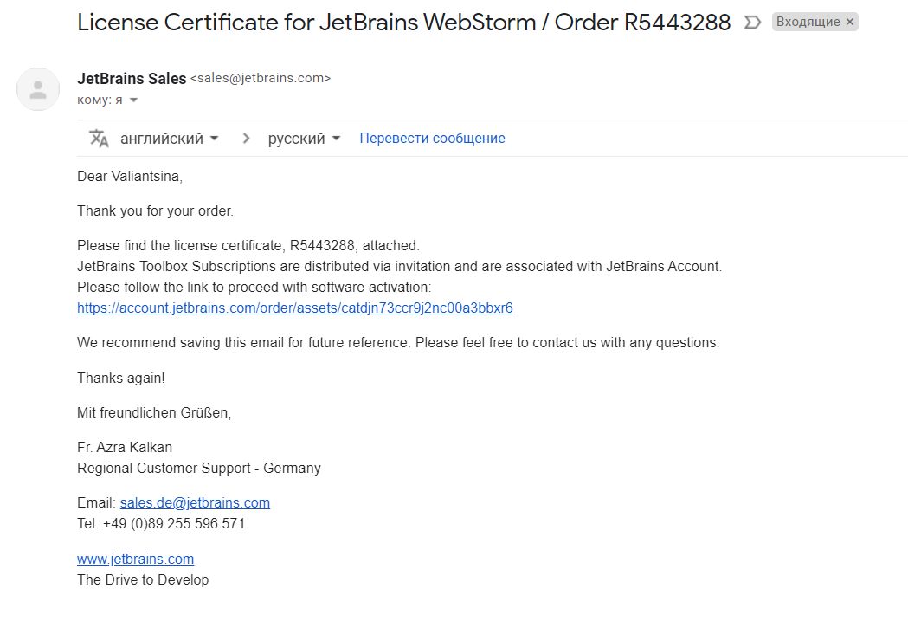
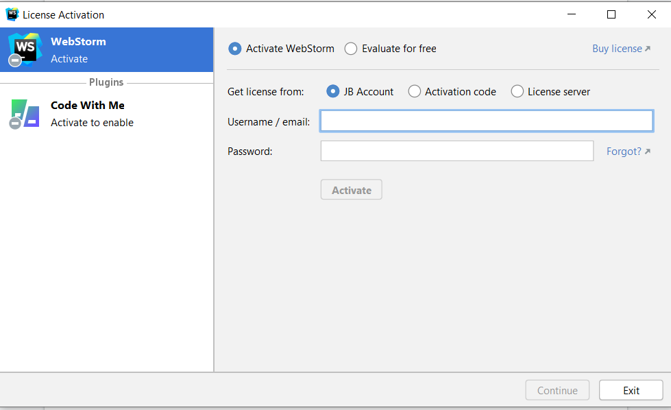

# Установка среды разработки

Для работы с веб-программами в нашей школе используется по возможности Idea от JetBrains или VSCode от Microsoft.

1. Скачать vscode - [тут](https://code.visualstudio.com/)
2. Скачать Idea - [тут](https://www.jetbrains.com/idea/download/)
3. Скачать JDK s [adoptopenjdk.net](https://adoptopenjdk.net/)

Как настроить всё для Java рассказано [здесь](https://www.youtube.com/watch?v=QHpYA4PLJjU&feature=youtu.bread)

Если в ТелРане вам выдали ключ для версии Idea Ultimate, то здесь пошаговая инструкция регистрации продукта. У школы есть ключи для студентов, которые можно использовать в учебных целях. 

## Инструкция по регистрации

### Шаг первый

### Шаг второй

### Шаг третий

### Шаг четвёртый

### Шаг пятый

## Домашнее задание

1. Найти в интернете статьи и прочитать о Java и JDK.
2. Почитать о компании JetBrains. Кто они, откуда, чем известны?
3. Почитайте о возможностях и настройке VSCode - [тут](https://habr.com/ru/post/490754/)